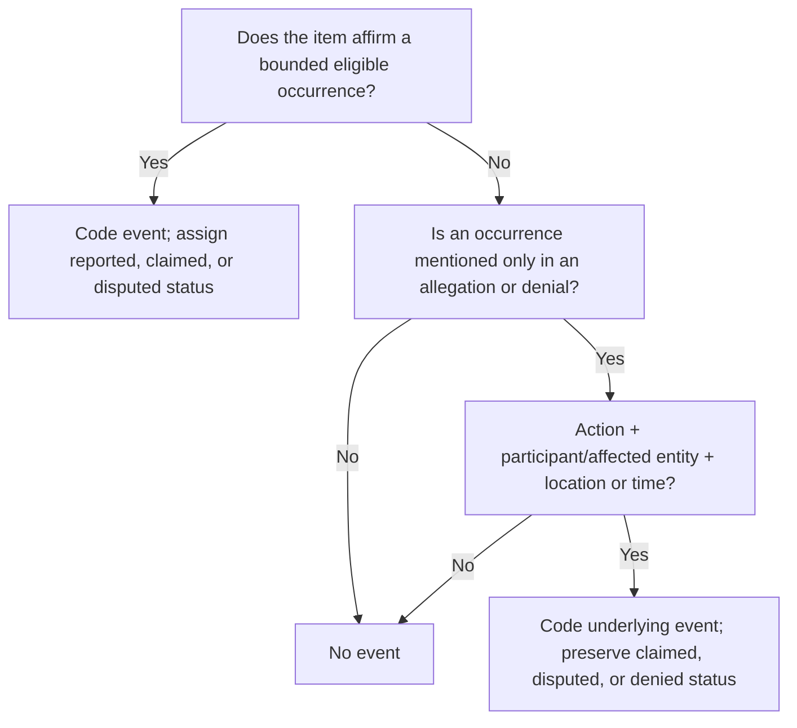

# Annotation codebook — pilot v0.2

**Paper:** *Lost in Extraction: Native vs. English-Pivot LLM Conflict-Event Coding across Six Languages*  
**Status:** Locked for excluded pilot items from this revision onward; not yet frozen for the final test set  
**Date:** 13 August 2026

**Change from v0.1:** Replaced news-structure-dependent primary-event wording with source-neutral rules that also cover eligible public social-media and official-source items. Event eligibility, event types, and model-target fields are unchanged.

## 1. Purpose and annotation principle

The task is to represent what a bounded source text **reports**, not what the annotator knows or believes happened in the world. Code only information supported by the text and supplied publication-date metadata. Preserve claims, uncertainty, disputes, and denials rather than resolving them with external knowledge.

One item produces either:

- no eligible current event; or
- one structured record for the item’s primary eligible event.

The codebook is ACLED-informed but deliberately flatter and smaller. It is a benchmark schema, not a reproduction of ACLED production coding.

## 2. Annotation input

Annotators receive:

- `item_id`;
- `language` and, where known, language variety;
- `publication_date` (the public post date for social-media items);
- one bounded source text or passage;
- source-origin and delivery-channel metadata.

Annotators do not see model outputs, pivot translations, other annotators’ labels, or external reporting about the same event.

## 3. Unit of analysis and primary event

### 3.1 One bounded item

An item is a single source document, public post, or deliberately bounded passage. Headlines are included when available because they may disambiguate the primary event. For items without a headline or conventional lead, use the opening and central content under the same rules.

### 3.2 One primary event

If the item contains multiple events, select the primary event in this order:

1. the event explicitly foregrounded by the headline and lead, or by the opening and central content when no headline/lead exists;
2. the new or most recent event that motivates publication;
3. the event receiving the greatest substantive coverage;
4. the event to which the item’s main actors and outcome refer.

Background, historical, comparative, and previously reported events do not become primary merely because they contain more complete details.

If two eligible current events remain genuinely tied after these rules, exclude the item from the main benchmark and record `ambiguous_primary_event` in the collection log. Do not invent an arbitrary hierarchy to break the tie.

### 3.3 Secondary events

Paper 1 does not create structured secondary-event records. Annotators may note a secondary/background event in comments only when needed to explain contamination risk. Such comments are not model targets.

## 4. Event eligibility

### 4.1 Positive event

Set `event_present=true` when the primary proposition describes a bounded, security-relevant occurrence that happened, is reported to have happened, is specifically alleged to have happened, is disputed, or is explicitly denied under the denial rule in §5.

Eligible occurrences include political violence, armed interaction, remote/explosive attacks, direct attacks, detention/security raids, abduction/disappearance, protests/violent disorder, specifically disrupted attacks, and closely related security events.

An event may be eligible even when:

- no fatalities are reported;
- the actor is unknown;
- the report is based on one party’s claim;
- accounts conflict;
- the event is denied but sufficiently described;
- only a relative date is given.

### 4.2 No event

Set `event_present=false` when the item contains only:

- a threat, prediction, warning, intention, or plan with no occurrence and no documented disruption;
- general analysis, commentary, or an undated description of a conflict trend;
- a meeting, policy statement, commemoration, funeral, or anniversary with no eligible security event;
- a historical retrospective with no new eligible occurrence;
- a vague reference to “an incident,” “violence,” or “allegations” that does not meet the denial/allegation minimum frame;
- an old event merely reposted or re-amplified as if current, when the item itself reports no new occurrence;
- an ongoing situation with no bounded action, participant/affected entity, and location or time;
- a weapon discovery or security activity too vague to constitute a bounded event;
- an operational plan that remains prospective.

For `event_present=false`, all remaining extraction fields are null, empty arrays, or `not_applicable` as specified by the schema.

## 5. Claims, allegations, disputes, and denials

This boundary is mandatory and is scored separately in inter-annotator agreement.

### 5.1 Minimum frame for an alleged or denied event

When the text does not affirm an event and mentions it only inside an allegation or denial, code an event **only if the proposition itself contains all three**:

1. a recognizable eligible action;
2. at least one participant or affected entity; and
3. a concrete location or time expression.

If any of the three is missing, code `event_present=false`.

This stricter rule applies only to allegation/denial-only cases. A straightforward positive report can remain eligible with an unknown actor or missing location/date.

### 5.2 Decision tree

### 5.3 Event assertion status

Choose one:

- `reported_as_fact` — the item presents the event as having occurred without explicit occurrence-level uncertainty or contradiction. This does **not** mean independently verified.
- `claimed_or_alleged` — the event’s occurrence is supplied only through a claim, allegation, unconfirmed report, or explicitly uncertain formulation, with no explicit denial in the item.
- `disputed` — the item presents incompatible live accounts about whether the event occurred.
- `denied` — the item’s only stance on occurrence is an explicit denial, but the denied proposition meets the minimum frame.
- `not_applicable` — only when `event_present=false`.

Uncertainty about the perpetrator alone does not make the event occurrence `claimed_or_alleged`; use `actor_attribution_status` for that distinction.

### 5.4 Actor attribution status

Choose one:

- `reported_as_fact` — the item presents actor/side A as the performer or participant without explicit attribution-level uncertainty or contradiction.
- `claimed_or_alleged` — actor identity is attributed only by a claim, allegation, “suspected,” “according to,” or equivalent uncertainty.
- `disputed` — the item gives competing actor attributions.
- `denied` — the named or alleged actor explicitly denies responsibility/participation and no competing attribution is presented as established.
- `unknown` — the source gives no actor identity beyond unknown/unspecified perpetrators, or actor/side A is empty.
- `not_applicable` — only when `event_present=false`.

### 5.5 Worked denial and attribution examples

| Source proposition | Event? | Event status | Actor status | Reason |
|---|---:|---|---|---|
| “The ministry denied that troops arrested reporter N in Central City on Monday.” | Yes: arrest/detention | `denied` | `denied` | The denied frame has action, participants, and place/time. |
| “The ministry denied reports of an incident in Central City.” | No | `not_applicable` | `not_applicable` | No recognizable action. |
| “Police rejected allegations of abuse.” | No | `not_applicable` | `not_applicable` | No bounded location or time; action is underspecified. |
| “Residents said an airstrike hit North District on Tuesday; the military denied any strike.” | Yes: remote/explosive | `disputed` | `disputed` if the military is the alleged actor | Affirmative claim and explicit denial conflict. |
| “A bomb exploded at the station. Group Q denied responsibility.” | Yes: remote/explosive | `reported_as_fact` | `denied` for Group Q if it is the only attributed actor | Occurrence is affirmed; only perpetrator identity is denied. |
| “Group Q claimed responsibility for the station bombing.” | Yes: remote/explosive | `reported_as_fact` if the bombing is otherwise affirmed; otherwise `claimed_or_alleged` | `claimed_or_alleged` for Group Q | Responsibility claim is not automatically an established attribution. |

## 6. Event-type decision order

Apply these questions to the selected primary event:

1. Was a specific attack or weapons use prevented before it occurred? → `disrupted_or_foiled_attack`.
2. Did two organized armed sides exchange force in the same episode? → `armed_clash`.
3. Was a remote, explosive, air, drone, artillery, missile, mine, IED, suicide-bomb, or grenade method used without a reciprocal clash dominating the same episode? → `remote_or_explosive_violence`.
4. Was direct physical violence inflicted or attempted without reciprocal armed interaction and without remote/explosive means defining the event? → `direct_attack_or_targeted_violence`.
5. Was the primary occurrence a detention, arrest, or security raid with no higher-priority violent event? → `arrest_detention_or_security_raid`.
6. Was a person coercively taken, held, or disappeared outside a reported arrest/detention framework? → `abduction_or_disappearance`.
7. Was the primary occurrence a public demonstration, riot, or mob/collective disorder? → `protest_or_violent_disorder`.
8. Is it a bounded eligible security event not covered above? → `other_eligible_event`.

The order is a disambiguation aid, not a substitute for primary-event selection.

## 7. Type definitions

### 7.1 `armed_clash`

**Include:** a reciprocal exchange of armed force between two or more organized armed sides in the same episode. Small-arms fire, ground fighting, or exchanged long-range fire can qualify.

**Exclude:** a one-directional attack with no reported return fire; harm to civilians during a unilateral attack; a mere standoff; a threatened clash; separate attacks mentioned in background.

**Role rule:** `actor_or_side_a` and `target_or_side_b` are neutral side labels. Their order does not assert initiation. Prefer the order in which the source introduces the sides.

**Example:** “Government troops and Front K fighters exchanged fire outside River Town.”

### 7.2 `remote_or_explosive_violence`

**Include:** air or drone strikes, shelling, artillery, missile or rocket attacks, mortars, suicide bombs, IEDs, mines, remotely/victim-activated explosives, grenades, or comparable widely destructive remote weapons.

**Exclude:** an explosive device safely defused before use; a cache merely found; exchanged fire that the source frames as an armed clash; direct shooting or stabbing.

**Priority rule:** if remote weapons are used within one continuous reciprocal battle and the clash is the primary event, code `armed_clash`. If the report centers on a discrete strike with no reciprocal engagement, use this type.

### 7.3 `direct_attack_or_targeted_violence`

**Include:** unilateral shooting, stabbing, beating, execution, assassination/targeted killing, raid-related killing, or other direct physical attack against a person or group, including armed or civilian targets, when no reciprocal clash is reported.

**Exclude:** remote/explosive methods; reciprocal fighting; detention without attack; threats; property damage with no direct physical attack unless the item clearly describes an attempted attack on persons.

**Attempt rule:** an attempted direct attack qualifies if the physical act began (for example, shots were fired) even when no one was injured. A plan stopped before execution is `disrupted_or_foiled_attack`.

### 7.4 `arrest_detention_or_security_raid`

**Include:** arrest, detention, custody, politically/security-relevant mass detention, or a bounded search/raid operation conducted for a security or enforcement purpose when no higher-priority violent event dominates.

**Exclude:** routine non-security policing outside the domain; an abduction framed as unlawful/coercive disappearance rather than custody; a raid whose primary reported result is a clash, strike, or killing; a planned raid not carried out.

**Raid rule:** a raid may qualify without an arrest if the text reports that security forces physically conducted the operation at a specific place/time. A vague statement that forces “launched operations” does not qualify without a bounded occurrence.

### 7.5 `abduction_or_disappearance`

**Include:** kidnapping, hostage taking, forcible removal, or forced disappearance outside a reported arrest/detention framework.

**Exclude:** detention presented as an arrest/custodial act; a missing-person report with no asserted coercive taking; a threat to kidnap; an abduction followed by killing in the same described episode when the killing is primary—then use direct attack.

### 7.6 `protest_or_violent_disorder`

**Include:** peaceful political demonstrations, protest gatherings, riots, violent demonstrations, or mob violence/collective disorder with public/security relevance.

**Exclude:** meetings or rallies with no protest/disorder dimension; purely online advocacy; an attack on protesters when the article’s primary event is the attack rather than the demonstration; planned protests that have not begun.

**Target rule:** the protested-against entity may be `target_or_side_b` only if explicit. For a protest with no named target, leave the target array empty.

### 7.7 `disrupted_or_foiled_attack`

**Include:** a specific bombing, strike, armed attack, or weapons use prevented before occurrence; a device safely defused; an attacker intercepted before executing the described attack; a concrete plot disrupted at an operational stage.

**Exclude:** generic warnings about possible attacks; routine weapons seizures not linked to a specific attack; an attack that began but failed; an explosive that detonated; an arrest with only vague suspicion.

**Specificity rule:** the source must describe the prevented act beyond a generic assertion that “an attack was foiled.” At minimum, it must identify an attack method or intended target plus a concrete place or time.

### 7.8 `other_eligible_event`

**Include sparingly:** a bounded, security-relevant occurrence outside the seven types, such as a non-violent territorial takeover, significant weapons seizure not linked to a specific planned attack, or security-relevant property destruction with no direct attack on persons.

**Exclude:** miscellaneous content that fails event eligibility. “Other” is not an uncertainty label and must not rescue an unclear item.

Annotators add a short comment explaining every `other_eligible_event`. Review its frequency after the pilot; a recurrent coherent subtype may justify a documented revision before v1.0, not after final annotation begins.

## 8. Field annotation rules

### 8.1 `event_present`

Boolean. Apply §§4–5. Do not infer an event solely from a domain-relevant keyword.

### 8.2 `event_type`

One label from §7 when positive; null when negative.

### 8.3 `action_text`

A minimal exact source substring that expresses the primary action. Preserve the input language and inflection. Do not paraphrase or translate.

Examples: the source-language equivalents of “exchanged fire,” “detained,” “exploded,” or “denied attacking.” Include a negation marker when it is part of the proposition.

### 8.4 `actor_or_side_a`

An array of exact source mentions for the performer or first side of the primary event.

- Use all explicitly coordinated actors performing the same primary action.
- For clashes, use the first side introduced by the source; no initiation is implied.
- Resolve pronouns only within the item when the antecedent is unambiguous; return the explicit antecedent surface form.
- A generic phrase such as “unknown gunmen” may be returned; set actor attribution to `unknown`.
- Do not expand abbreviations or replace mentions with canonical names.
- Leave empty if no actor/side can be supported.

### 8.5 `target_or_side_b`

An array of exact source mentions for the recipient, affected party, detainee/abductee, protested-against entity, or second clash side.

- Do not treat a location as a target unless the text grammatically presents the facility/place as the attacked target.
- Civilians harmed incidentally may be targets only if the primary action is directed at or explicitly affects them.
- Leave empty if no target/second side is supported.

### 8.6 `location_text`

The most specific exact source substring that locates the primary event. Return null if absent.

- Do not infer country, province, district, or coordinates from external knowledge.
- If the source gives a nested phrase, retain the shortest phrase that is both specific and unambiguous in the item.
- Do not normalize spelling or transliteration.

### 8.7 `date_text`

The exact source substring that states when the primary event occurred. Return null if absent.

- Preserve “Monday,” “yesterday,” a local-calendar date, or another surface form.
- Publication date may help distinguish event date from publication date, but do not output a normalized date.
- Do not substitute publication date when the event date is unstated.
- Do not use a date that belongs only to a background event.

### 8.8 `event_assertion_status`

Apply §5.3. Status describes how the **item** presents occurrence, not external truth.

### 8.9 `actor_attribution_status`

Apply §5.4. This is separate from occurrence status.

### 8.10 `claimant`

An array of exact source mentions for persons or organizations that make a claim, allegation, attribution, or denial material to the primary event.

- Empty when the item presents the event/actor without a relevant attributed claim or denial.
- Include a responsibility claimant when a group claims it carried out an attack.
- Include an official or organization that denies occurrence or responsibility.
- A claimant may legitimately overlap the actor when claiming responsibility; overlap is not itself an error.
- This field supports claim-to-fact and claimant-to-actor-collapse analysis and is not independently scored with precision/recall/F1.

### 8.11 `evidence_quote`

An array of one to three exact contiguous substrings from the item that collectively support the complete record.

- Copy verbatim; do not translate, normalize, correct spelling, or insert ellipses inside a quote.
- Use the shortest quote(s) that support event occurrence/type, action, actors/targets, location/date, and epistemic status.
- When claim or denial status matters, include the attribution or denial wording.
- If identical text occurs multiple times, include enough surrounding context to make the intended occurrence searchable and unique.
- Character offsets are not manually annotated.

## 9. Permitted and prohibited inference

### 9.1 Permitted

- unambiguous within-item pronoun/coreference resolution;
- syntactic identification of who performed and received an action;
- recognizing that relative-time wording is a date expression while preserving its surface form;
- recognizing common event paraphrases defined by the type rules;
- using the retained headline or opening context, together with publication-date metadata, to select the current primary event.

### 9.2 Prohibited

- web search, background knowledge, or another report;
- inferring an unnamed actor from who usually operates in a region;
- converting a locality into a district/province/country not stated in the item;
- expanding an organization alias or abbreviation beyond the text;
- resolving a relative date into a calendar date in the model record;
- treating a claimant as the performer unless the source attributes performance to it;
- upgrading allegations, responsibility claims, or official statements to fact;
- moving an actor, date, location, or casualty detail from a secondary/background event into the primary record;
- translating source-surface output fields.

## 10. Hard-negative categories

Tag hard-negative type in collection metadata, not in the model record:

1. `future_threat_or_plan`
2. `underspecified_denial_or_allegation`
3. `historical_or_anniversary`
4. `background_events_only`
5. `recycled_or_resurfaced_old_report`
6. `security_meeting_or_statement_only`
7. `ongoing_violence_without_bounded_event`
8. `publication_date_only`
9. `vague_security_operation`
10. `other_domain_near_miss`

## 11. Additional worked examples

All examples are fictional and non-operational.

| Text | Gold decision | Key point |
|---|---|---|
| “Front K said it attacked a checkpoint in North District on Friday. Officials did not confirm the report.” | Direct attack; event `claimed_or_alleged`; actor `claimed_or_alleged`; claimant Front K | Preserve both event and attribution uncertainty. |
| “A device exploded near a bus in East Town on Tuesday; no group claimed responsibility.” | Remote/explosive; actor empty/`unknown`; target bus if grammatically affected; date/location explicit | Unknown actor does not make occurrence uncertain. |
| “Police found and safely defused an IED beside the courthouse on Sunday.” | Disrupted/foiled attack | Device did not detonate. |
| “Police warned that militants may target courts next month.” | No event | Prospective warning only. |
| “Troops raided three houses in Lake District and detained two suspects.” | Arrest/detention/security raid; primary action chosen from lead emphasis | Same-event raid and detention, no higher-priority violence. |
| “During the raid, troops and fighters exchanged fire; two suspects were later detained.” | Armed clash if exchange is the lead/primary event | Reciprocal violence dominates the same episode. |
| “A reporter was abducted on Monday and found killed hours later; the article leads with the killing.” | Direct attack/targeted violence | Killing is primary; do not code abduction as primary. |
| “Hundreds demonstrated outside parliament; several burned tires and clashed with police.” | Protest/violent disorder | Collective demonstration/disorder is central. |
| “The article marks ten years since the Central City bombing and reports no new incident.” | No event | Historical/anniversary hard negative. |
| “Officials said violence has increased across the province in recent weeks.” | No event | Trend without a bounded action. |
| “Security forces seized a large weapons cache at a warehouse; no specific planned attack was reported.” | Other eligible event | Significant bounded security event, but not a foiled attack. |
| “A former official said Group R was behind Tuesday’s bombing; Group R denied responsibility. The bombing itself is reported as having occurred.” | Remote/explosive; event `reported_as_fact`; actor `disputed`; claimants former official and Group R | Separate occurrence from perpetrator attribution. |

## 12. Pilot and disagreement procedure

### 12.1 Pilot composition

Annotate 10–15 excluded items per language. Ensure the pilot deliberately tests denials, claims, hard negatives, type boundaries, relative dates, unknown actors, and background contamination.

### 12.2 Revision log

Every codebook change after pilot use must record:

- item IDs that exposed the problem;
- original rule;
- revised rule;
- reason for revision;
- fields/items requiring reannotation.

### 12.3 Freeze

After pilot adjudication:

1. produce `v1.0` of the codebook, schema, and prompt;
2. reannotate all pilot items under v1.0 to confirm the rule works;
3. exclude pilot items from the final benchmark;
4. begin final annotation only after the three artifacts agree exactly.

### 12.4 IAA watch list

Report agreement separately for:

- event presence;
- event type;
- event assertion status;
- actor attribution status;
- denial-only eligibility;
- actor/target/location/date spans or value sets.

Inspect denial-only eligibility and `armed_clash` versus unilateral attack disagreement even if overall agreement is high.

## 13. Questions the pilot must answer

1. Do three evidence quotes suffice for multi-sentence records?
2. Is the denial minimum frame consistently applied across languages?
3. Does `arrest_detention_or_security_raid` absorb too many vague operations?
4. Is `other_eligible_event` rare and coherent enough to retain?
5. Can annotators reliably separate event occurrence from actor attribution?
6. Are actor/target arrays necessary often enough to justify set-based scoring?
7. Does the one-primary-event rule force exclusions at an acceptable rate?
